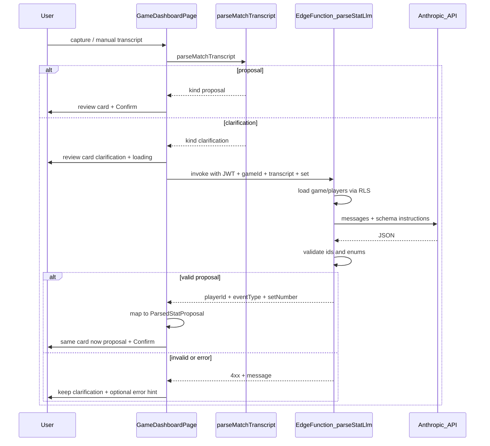

# 2026-04-04 Sub-Plan: LLM Narrow Fallback Behind Deterministic Parser

## Summary

Add a **Supabase Edge Function** that calls **Anthropic** with a **strict JSON contract**, invoked **only after** the existing deterministic parser in [`src/lib/matchParser.ts`](../../src/lib/matchParser.ts) returns a **clarification**. On success, **upgrade the same review-queue item** to `kind: "proposal"` so [`handleConfirmReviewItem`](../../src/features/dashboard/GameDashboardPage.tsx) and persistence stay **unchanged**.

This document is a local planning artifact in `ai/roadmaps`. See [`aiDocs/context.md`](../../aiDocs/context.md) for canonical product pointers.

We need to **avoid over-engineering, cruft, and legacy-compatibility features** in this clean code project. This sub-plan intentionally defers post-game narrative, per-utterance LLM, and client-side API keys.

## In Scope

- Edge-hosted Anthropic call with **user JWT** and **RLS-scoped** game + player reads for validation.
- Client invoke behind **`VITE_LLM_PARSE_ENABLED`** (or equivalent), **allowlisted** clarification reasons and transcript guards.
- Review queue UX: **“Checking with AI…”** on clarification rows; proposals from LLM tagged via **`matchedPlayerBy`** (e.g. `["llm"]`).
- Structured logging (`capture.parse.llm.*`) — no secrets in logs.

## Out Of Scope

- LLM on **every** utterance; cloud ASR; storing raw transcripts in Postgres (see [`aiDocs/evidence/phase_2_voice_pipeline_boundaries.md`](../../aiDocs/evidence/phase_2_voice_pipeline_boundaries.md)).
- Changes to [`confirmStatEvent`](../../src/lib/data.ts), RLS policies, or stat schema beyond what a normal proposal already requires.

---

## Recommendation on confirmation UI

**Keep the same confirmation UI** for commits: `handleConfirmReviewItem` already only persists when `item.result.kind === "proposal"`. No second confirmation step.

**Small UX additions** (same card, not a new screen):

- While an LLM attempt is in flight for a clarification card, show **“Checking with AI…”**.
- When the item becomes a proposal via LLM, reuse **“Matched by …”** with `matchedPlayerBy` including **`llm`** (or **`ai_assist`**) so the coach knows the suggestion is machine-assisted before **Confirm event**.

---

## Target flow

---

## Backend: new Edge Function

- Add **`supabase/functions/parse-stat-llm/index.ts`** (name adjustable; keep single-purpose).
- **Secrets:** `ANTHROPIC_API_KEY`; `SUPABASE_URL` + `SUPABASE_ANON_KEY` (Supabase Edge defaults). **Never** ship Anthropic key to the browser.
- **Auth:** Require `Authorization: Bearer <user_jwt>`. Instantiate Supabase client with **anon key** + user JWT in global headers so **RLS applies**.
- **Authorization:** `select` game by `game_id` from body; empty → **403**. Load **players** for that game’s `team_id` via RLS. **Do not** trust client-supplied roster for validation — only IDs from this query are valid `player_id` values.
- **Model I/O:** Prompt includes transcript, current set, compact roster (`id`, jersey, first/last`). Model returns **only JSON**, e.g. `{ "event_type": "<StatEventType>", "player_id": "<uuid>" }` or `{ "clarification": true, "message": "..." }` when unsafe to map.
- **Post-processing:** Parse JSON; assert `event_type` ∈ [`StatEventType`](../../src/lib/database.types.ts); assert `player_id` ∈ loaded roster. Else **422** with a short message.
- **Implementation:** Prefer **`fetch` to Anthropic Messages API** in Deno; **abort** ~8–12s.

---

## Frontend integration

- Add **`src/lib/parseStatLlm.ts`**: `functions.invoke('parse-stat-llm', { body: { gameId, transcript, setNumber }, headers: { Authorization: \`Bearer ${access_token}\` } })` via session from `supabase.auth.getSession()`.
- Extend **`ReviewItem`** in `GameDashboardPage.tsx` with e.g. `llmAssist: { status: 'idle' | 'loading' | 'error' | 'skipped'; message?: string }`.
- In **`handleCapturedTranscript`**: if `result.kind === 'clarification'` **and** LLM enabled:
  - Push item with `llmAssist: { status: 'loading' }`.
  - Await invoke; on success, replace `result` with `{ kind: 'proposal', proposal: { ... } }` (display fields from DB player row, `matchedPlayerBy: ['llm']`, `setNumber` from game).
  - On failure/timeout, set `llmAssist` to error/skipped; **keep** original clarification.
- **Guards:** Call only for allowlisted reasons (start with **`missing_event_type`**, **`missing_player`**; optionally **`ambiguous_player`** later) and bounded transcript length.
- **Logging:** `capture.parse.llm.started` / `completed` / `failed` (gameId, latency, outcome — no API key).

---

## Docs and env

- Document **`VITE_LLM_PARSE_ENABLED`** and Edge **`ANTHROPIC_API_KEY`** wherever the repo documents env (e.g. README / example env). **Do not** commit secrets. Remote: Supabase dashboard secrets for the function; local: `supabase secrets set` per CLI docs.

---

## Testing

- **Unit (optional):** mapping Edge JSON → `ParsedStatProposal` and validation edge cases.
- **Manual:** `supabase functions serve` + app on local stack; deterministic phrase **never** hits LLM; failed rules + good slang → LLM proposal → Confirm writes row; invalid model output leaves clarification.

---

## Implementation checklist (mirror of execution todos)

| # | Task |
|---|------|
| 1 | Edge Function: JWT, RLS game/players, Anthropic `fetch`, JSON validate |
| 2 | `parseStatLlm.ts` + env flag; allowlisted reasons + transcript guards |
| 3 | `ReviewItem` + `handleCapturedTranscript` upgrade path + UI loading |
| 4 | Secrets wiring + env documentation |
| 5 | `appLog` + manual verification |

When this pair is **fully implemented**, update the roadmap checkboxes, move both files to `ai/roadmaps/complete/`, and add a line to [`ai/changelog.md`](../changelog.md) per `aiDocs/context.md` workflow.
