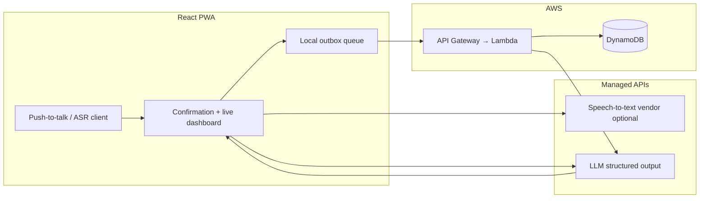

# Architecture — Stat Side

**Status:** Draft (aligned with [PRD](./prd.md) §6–7 and [MVP](./mvp.md))  
**Last updated:** April 2026

---

## 1. Goals

- **Eyes-up coaching:** Push-to-talk voice → fast, reviewable stat events; no silent commits.
- **Cross-platform MVP:** Single installable **PWA** (not native app stores).
- **Resilient sideline:** Tolerate spotty gym Wi‑Fi via **offline-first client behavior** (cached shell + queued writes) per PRD.
- **Explainable stats:** Roster-aware NLP + mandatory **confirmation UI** before persistence.

---

## 2. Logical system

**Runtime path (happy path):**

1. User completes utterance (push-to-talk release or end-of-phrase).
2. **ASR** produces text (browser **Web Speech API** and/or server/vendor streaming — **Deepgram** / **Whisper**; prototype before locking).
3. **LLM** maps text + **roster context** → JSON (`stat event` or `clarification`) — e.g. Claude / GPT‑4 class, PRD-aligned.
4. **Confirmation UI** shows parsed event; user accepts, corrects, or undoes.
5. **POST** canonical event(s) to **Lambda** → **DynamoDB**.
6. **Live dashboard** updates via **poll or WebSocket** (PRD allows either; choose based on complexity and cost).
7. **Post-game:** Lambda (or separate worker) loads aggregated events → **LLM narrative** → stored + shown in client.

---

## 3. Client (React PWA)

| Concern | Direction |
|--------|-----------|
| **Shell / offline** | Service worker + precaching so the app loads without network; **vite-plugin-pwa** (Workbox) is a common Vite/React approach — `generateSW` or `injectManifest` if custom caching/routing is needed ([vite-plugin-pwa docs](https://context7.com/vite-pwa/vite-plugin-pwa)). |
| **Offline writes** | IndexedDB or in-memory **outbox**: queue stat writes when offline; replay with idempotency keys when online. UI shows sync state. |
| **Mic / ASR** | Explicit user gesture for capture; handle permission errors gracefully on iOS Safari. |
| **Trust UX** | Every committed stat visible on confirmation card; undo + event log edits per PRD/MVP. |

---

## 4. Voice and NLP

| Layer | Responsibility |
|-------|----------------|
| **ASR** | Accurate transcript under gym noise; evaluate **Web Speech API** vs **Deepgram** (streaming) vs **Whisper** (latency tradeoff) using PRD gym test before committing. |
| **NLP** | Single structured prompt: roster + allowed stat vocabulary + few-shot or schema description → **JSON only** (event or clarification). Never persist without user confirm. |
| **Latency** | Stream partial ASR text if available; fire LLM on phrase end; keep confirmation UI snappy. |

**Core event shape (conceptual):** `{ player_id, action, result, set, timestamp, ... }` per PRD.

---

## 5. Backend (AWS)

| Component | Role |
|-----------|------|
| **API Gateway** | HTTP API in front of Lambda — auth, throttling, staging, custom domain when needed. PRD baseline; **Lambda Function URLs** are simpler for prototypes but lack Gateway-level controls ([AWS invoke guidance](https://docs.aws.amazon.com/lambda/latest/dg/apig-http-invoke-decision.html)). |
| **Lambda** | REST handlers: teams/rosters, games, append stat events, fetch aggregates, trigger/fetch post-game summary. |
| **DynamoDB** | **Event store** for stat lines; entities for **team**, **player**, **game/session**. Access patterns drive keys/GSIs (e.g. list events by `gameId`, totals per `gameId#set`). |

**Secrets:** LLM and paid ASR keys stay **server-side** (Lambda env / Secrets Manager); browser calls go through your API or short-lived tokens if a client ASR path is unavoidable.

---

## 6. Data model (MVP sketch)

Exact attributes can evolve in implementation; relationships matter more for the first cut:

- **Team** — id, name, owner/coach ref (when auth exists).
- **Player** — id, teamId, display name, jersey number, optional nicknames for NLP.
- **Game** — id, teamId, opponent label, schedule metadata, current set, score by set.
- **StatEvent** — id, gameId, playerId, action type, set index, timestamp, source (voice/manual), optional raw transcript snippet for debugging (privacy policy TBD).
- **Summary** — gameId, narrative text, generatedAt.

---

## 7. Real-time live stats

- **Polling:** Simplest MVP — `GET` aggregates every N seconds during a match.
- **WebSocket (API Gateway):** Push updates when event count/low-latency matters; adds connection management and cost.

Pick after baseline API exists; MVP accepts either per PRD.

---

## 8. Post-game narrative

- **Input:** Aggregated **StatEvent**s + roster names + prior game summary if available (PRD).
- **Process:** One Lambda invocation (or Step Functions if chunked) calling LLM with **read-only** stats JSON.
- **Output:** Persist `Summary` row; client shows on match end.

---

## 9. Security and compliance (MVP stance)

- Authenticate coaches before exposing rosters and games (Cognito, Auth0, or similar — **TBD** in implementation).
- **HTTPS** everywhere; CORS locked to app origin.
- Student-athlete / **FERPA** implications noted in PRD open questions — retention and transcript storage need explicit policy before production scale.

---

## 10. Risks (architecture-relevant)

| Risk | Mitigation |
|------|------------|
| Gym noise / ASR errors | Vendor bake-off + confirmation + undo |
| NLP ambiguity | Roster-rich prompts + clarification JSON + human confirm |
| Wi‑Fi drops | Outbox + idempotent writes + cached PWA shell |
| Latency | Streaming ASR; async post-game summary acceptable if in-game path stays fast |

Full table: [PRD §7](./prd.md).

---

## 11. Post-MVP (V1) touchpoints

- **Multi-writer** sessions: author + role on each event; dedup rules.
- **Exports:** CSV / MaxPreps-shaped payloads from same event store.
- **Native apps** only after PWA validation.

---

## 12. Open implementation choices

- Monorepo vs separate `infra/` repo; **CDK / SST / Terraform** — not fixed in PRD.
- Exact **auth** provider and **multi-tenancy** model (team isolation).
- Observability: CloudWatch + structured logs; optional X-Ray on Lambda.

For product scope, see [MVP](./mvp.md); for full requirements, [PRD](./prd.md).
