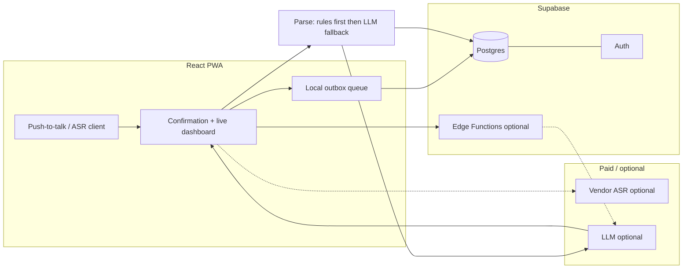

# Architecture — WhisperStat

**Status:** Draft (aligned with [PRD](./prd.md) §6–7 and [MVP](./mvp.md); backend choice: **Supabase**)  
**Last updated:** April 2026

---

## 1. Goals

- **Eyes-up coaching:** Push-to-talk voice → fast, reviewable stat events; no silent commits.
- **Cross-platform MVP:** Single installable **PWA** (not native app stores).
- **Resilient sideline:** Tolerate spotty gym Wi‑Fi via **offline-first client behavior** (cached shell + queued writes) per PRD.
- **Explainable stats:** Roster-aware NLP + mandatory **confirmation UI** before persistence.

---

## 2. Bootstrap cost posture (early stage)

Design the first builds so **usage bills stay near zero** until there is traction. Pay only where quality truly blocks validation.

| Area                                 | Prefer now (low / no $)                                                                                                                     | Defer or skip until needed                                                                                                 |
| ------------------------------------ | ------------------------------------------------------------------------------------------------------------------------------------------- | -------------------------------------------------------------------------------------------------------------------------- |
| **Speech-to-text**                   | **Web Speech API** in the browser — no per-minute ASR vendor bill.                                                                          | **Deepgram**, cloud **Whisper API**, etc.                                                                                  |
| **Whisper**                          | **Local Whisper** (e.g. whisper.cpp) for **offline experiments** — $0 API.                                                                  | Paid transcription APIs until Web Speech + confirmation UX fails your gym test.                                            |
| **In-game “NLP”**                    | **Deterministic / small parser** for common patterns (`#` + jersey, keywords like kill/ace/dig) **plus** roster lookup — reduces LLM calls. | Full LLM on every utterance if the cheap path handles most beta traffic.                                                   |
| **LLM (ambiguous phrases + polish)** | **Smallest model** that keeps JSON reliable; **call only when** the rule-based path returns low confidence.                                 | Premium models on every tap.                                                                                               |
| **Post-game narrative**              | **Template** from aggregates (bullet standouts from sorted totals) — $0.                                                                    | One **batched** LLM call per game when budget allows.                                                                      |
| **Hosting (static PWA)**             | **GitHub Pages**, **Cloudflare Pages**, or **Netlify / Vercel** free tiers (Supabase hosts **data + auth**, not the JS bundle).             | Paid CDN until traffic demands it.                                                                                         |
| **Backend / DB / auth**              | **Supabase free tier** (Postgres + Auth + generous limits for a single team / low traffic).                                                 | Paid Supabase plan when storage, MAU, or egress grow.                                                                      |
| **Live updates**                     | **Short-interval polling** via Supabase client or REST — simple and predictable.                                                            | **Supabase Realtime** subscriptions when you want push without polling overhead (still fine on free tier at modest usage). |
| **Secrets for LLM**                  | **Supabase Edge Function** env vars — proxy model calls so keys never ship to the browser.                                                  | Extra secret managers until you outgrow Edge env.                                                                          |

**Almost unavoidable eventually:** Some **LLM API spend** if natural language + narrative are core — keep traffic small with confirmation, roster prompt caching, and **don’t** pay for cloud ASR until Web Speech + local tests fail.

---

## 3. Logical system

**Runtime path (happy path):**

1. User completes utterance (push-to-talk release or end-of-phrase).
2. **ASR** — start with **Web Speech API**; add vendor ASR only if validation requires it (see §2).
3. **Parse** — try **deterministic extraction** + roster match; if unclear, call **LLM** (from browser only with public-safe keys **or** via **Edge Function** holding the provider key) → JSON (`stat event` or `clarification`).
4. **Confirmation UI** shows parsed event; user accepts, corrects, or undoes.
5. **Insert** canonical row(s) into **Postgres** via Supabase client (**RLS** enforces coach/team scope) or RPC if you centralize writes.
6. **Live dashboard** — **poll** or subscribe with **Realtime** on `stat_events` (or materialized aggregates); start with polling for simplicity (§2).
7. **Post-game:** read aggregates from Postgres → template copy and/or **one** Edge Function + LLM → upsert **summary** row.

---

## 4. Client (React PWA)

| Concern             | Direction                                                                                                                                                                                          |
| ------------------- | -------------------------------------------------------------------------------------------------------------------------------------------------------------------------------------------------- |
| **Shell / offline** | Service worker + precaching; **vite-plugin-pwa** (Workbox) — `generateSW` or `injectManifest` if custom routing is needed ([vite-plugin-pwa docs](https://context7.com/vite-pwa/vite-plugin-pwa)). |
| **Offline writes**  | IndexedDB or in-memory **outbox**; replay with idempotency when online. UI shows sync state.                                                                                                       |
| **Mic / ASR**       | Explicit user gesture; handle iOS Safari permission quirks.                                                                                                                                        |
| **Trust UX**        | Confirmation card, undo, event log edits per PRD/MVP.                                                                                                                                              |
| **Supabase client** | Use official JS client with Auth session; respect **RLS** policies so coaches only see their teams’ rows.                                                                                          |

---

## 5. Voice and NLP

| Layer                | Responsibility                                                                                               |
| -------------------- | ------------------------------------------------------------------------------------------------------------ |
| **ASR**              | Default: **Web Speech API**. Escalate to paid STT only after gym testing; **local Whisper** for offline R&D. |
| **Structured parse** | Roster + vocabulary → **JSON**; **rules-first** where possible; LLM for ambiguity.                           |
| **Latency**          | Partial ASR in browser; LLM on phrase end or fallback path only.                                             |

**Core event shape (conceptual):** `{ player_id, action, result, set, timestamp, ... }` per PRD — maps to a `stat_events` table (or equivalent) in Postgres.

---

## 6. Backend (Supabase)

| Piece                         | Role                                                                                                                                                          |
| ----------------------------- | ------------------------------------------------------------------------------------------------------------------------------------------------------------- |
| **Postgres**                  | Source of truth: teams, players, games, `stat_events`, post-game **summaries**. Normalized schema; SQL for reports and exports (V1).                          |
| **Auth**                      | Coach accounts (magic link / email per product decision). **`user_id`** / claims drive **RLS** so each coach reads/writes only allowed teams.                 |
| **Row Level Security**        | Policies on `teams`, `players`, `games`, `stat_events` (e.g. `team_id` in JWT app metadata or join through membership table).                                 |
| **API**                       | Auto-generated REST and PostgREST; **Supabase JS client** from the PWA for typed queries and inserts.                                                         |
| **Edge Functions (optional)** | **LLM proxy** (hide provider API key), **webhooks**, or heavy transforms — Deno runtime; invoke from client after user confirms, or only for post-game batch. |
| **Realtime (optional)**       | Postgres `LISTEN`/`NOTIFY` bridge — subscribe to `stat_events` for live dashboards when you outgrow polling.                                                  |

**Secrets:** Provider keys for LLM (and any server-side STT) live in **Edge Function secrets** or **project env** — never in the browser for production.

---

## 7. Data model (MVP sketch)

### Core tables

Maps directly to Postgres tables with full schema:

#### **teams**

Primary aggregation point for coach ownership and roster context.

- `id` (uuid, PK)
- `name` (text, not null)
- `user_id` (uuid, FK → auth.users) — coach/owner
- `created_at` (timestamp)
- RLS: coaches can only read/write teams they own

#### **players** (roster)

Player reference for NLP resolution and stat attribution.

- `id` (uuid, PK)
- `team_id` (uuid, FK → teams, not null)
- `first_name` (text, not null)
- `last_name` (text, not null)
- `jersey_number` (int, not null)
- `position` (text, nullable) — e.g. "setter", "outside", "middle" (optional but helpful for post-game context)
- `aliases` (text[], nullable) — common nicknames for roster matching
- `created_at`, `updated_at` (timestamp)
- Constraint: `UNIQUE(team_id, jersey_number)` — no duplicate jersey per team
- RLS: coaches see players only from their teams

#### **games**

Match metadata and set tracking.

- `id` (uuid, PK)
- `team_id` (uuid, FK → teams, not null)
- `opponent_name` (text, not null)
- `game_date` (timestamp, not null)
- `location` (text, nullable)
- `status` (text, not null, default 'in-progress') — e.g. 'draft', 'in-progress', 'completed'
- `current_set` (int, default 1) — tracks which set is active
- `created_at`, `updated_at` (timestamp)
- RLS: coaches see games only from their teams

#### **stat_events** (core)

Individual player actions logged during a match.

- `id` (uuid, PK)
- `game_id` (uuid, FK → games, not null)
- `player_id` (uuid, FK → players, not null)
- `event_type` (text, not null) — enum: 'kill', 'ace', 'serve_error', 'reception_error', 'block', 'dig', 'attack_error', 'set'
- `set_number` (int, not null)
- `timestamp` (timestamp, not null) — when the play occurred (in-game time)
- `created_by` (uuid, FK → auth.users, not null) — which coach logged it
- `notes` (text, nullable) — optional context
- `deleted_at` (timestamp, nullable) — soft delete for undo/correction trails (do NOT hard delete)
- `client_event_id` (uuid, nullable) — idempotency key for offline replay (prevents duplicate inserts from retried writes)
- `created_at` (timestamp) — insertion timestamp
- Indexes: `(game_id, set_number)`, `(game_id, player_id)`, `(player_id, event_type)` for dashboard aggregates
- RLS: coaches see stat_events only from their teams (via game_id → team_id)

#### **game_summaries** (optional)

Post-game narrative and aggregate snapshots.

- `id` (uuid, PK)
- `game_id` (uuid, FK → games, one-to-one, not null)
- `narrative_text` (text, not null) — AI-generated (or templated) summary
- `generated_at` (timestamp, not null)
- `model` (text, nullable) — which LLM or template version created it
- `created_at` (timestamp)
- RLS: coaches see summaries only from their games

### Design notes

**Soft deletes:** Never hard-delete `stat_events`. Use `deleted_at` and filter with `WHERE deleted_at IS NULL` in queries. This preserves the audit trail for "undo" and corrections without losing coach trust in event history.

**Idempotency:** For offline-first write replay, assign a unique `client_event_id` (generated in the browser) before queuing the write. On replay, upsert by `client_event_id` to prevent double-insertion if the network retry fires the same event twice.

**Jersey uniqueness:** `UNIQUE(team_id, jersey_number)` enforces that a number can't be assigned to two players on the same team, simplifying NLP resolution.

**Normalization:** Roster (`players`) is separate from events (`stat_events`) to avoid redundancy; team info is shared via foregin keys (no data duplication).

**Set tracking:** Store `set_number` with each event for accurate per-set aggregates and live dashboard filtering.

### Queries (dashboard examples)

Common aggregates for the live dashboard (building blocks for the React UI):

- **Kills per player, this set:** `SELECT player_id, COUNT(*) FROM stat_events WHERE game_id = $1 AND set_number = $2 AND event_type = 'kill' AND deleted_at IS NULL GROUP BY player_id`
- **Total errors by type (serve, reception, attack):** `SELECT event_type, COUNT(*) FROM stat_events WHERE game_id = $1 AND deleted_at IS NULL GROUP BY event_type`
- **Live leaderboard (all sets, no soft-deleted):** Join `players` on `player_id`, group by player, count by event type, order by kill count DESC

Use FKs and indexes on `(game_id, set_number)`, `(game_id, player_id)` for efficient dashboard queries.

---

## 8. Real-time live stats

- **Polling (default):** Periodic `select` / RPC for aggregates — simplest and predictable on free tier.
- **Supabase Realtime:** Subscribe to `stat_events` inserts/updates for push-style UI when you want lower latency without running your own WebSocket server.

---

## 9. Post-game narrative

- **Input:** Aggregated rows from **`stat_events`** + roster + prior summary if stored.
- **Process (cheap first):** **Deterministic template** from SQL-sorted stats — no model. **Upgrade:** one **Edge Function** call with a **small** LLM to generate prose; write result to **`game_summaries`**.
- **Output:** Read through Supabase client; show on match end.

---

## 10. Security and compliance (MVP stance)

- **Supabase Auth** for coach identities; **RLS** mandatory before any production roster or minor-related data.
- **HTTPS** only; restrict Supabase **anon key** exposure with RLS (never rely on obscurity).
- **FERPA** / retention — see [PRD open questions](./prd.md); trim `raw_transcript` storage if not strictly needed.

---

## 11. Risks (architecture-relevant)

| Risk                   | Mitigation                                                        |
| ---------------------- | ----------------------------------------------------------------- |
| Gym noise / ASR errors | Vendor bake-off + confirmation + undo                             |
| NLP ambiguity          | Roster-rich prompts + clarification JSON + human confirm          |
| Wi‑Fi drops            | Outbox + idempotent writes + cached PWA shell                     |
| Latency                | Streaming ASR; async post-game summary if in-game path stays fast |
| Auth / data leaks      | RLS tests; minimal service-role key usage (server/Edge only)      |

Full table: [PRD §7](./prd.md).

---

## 12. Post-MVP (V1) touchpoints

- **Multi-writer** sessions: `created_by`, roles, dedup — still backed by Postgres.
- **Exports:** CSV / MaxPreps-shaped files from SQL or Edge Function.
- **Native apps** only after PWA validation.

---

## 13. Open implementation choices

- **Hosting** for the static PWA (Cloudflare Pages vs Netlify vs Vercel) — orthogonal to Supabase.
- **Migrations:** Supabase CLI / SQL migrations in repo vs dashboard-only early on.
- **Observability:** Supabase logs + Edge Function logging; add Sentry or similar when needed.

For product scope, see [MVP](./mvp.md); for full requirements, [PRD](./prd.md).
